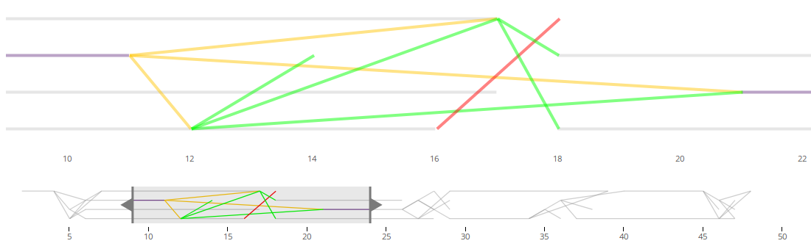

# consensus-draw

    

This is an open-source effort for providing better comprehension of Neo Consensus.

Suggested reading:
[Practical
Byzantine
Fault
Tolerance](http://pmg.csail.mit.edu/papers/osdi99.pdf)

## Drawing messages from NEO Consensus

    

## How to use

### Node express server

`npm install`

RUN: `runConsensusDraw.sh`

**ACCESS:** `http://localhost:20000`

An example will be created automatically with `generateExample.sh`

Or... get it from running neocompiler-eco: `./getremotelog/getconsensuslog.sh`

## License

The code is **MIT Licensed** (except for express indications).

NeoResearch 2018
